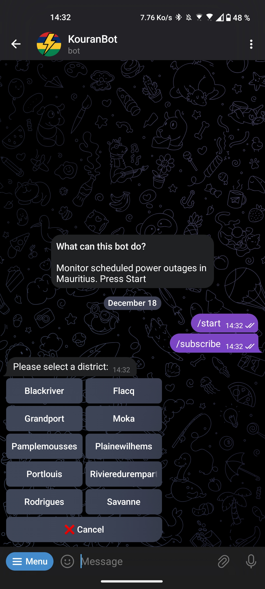
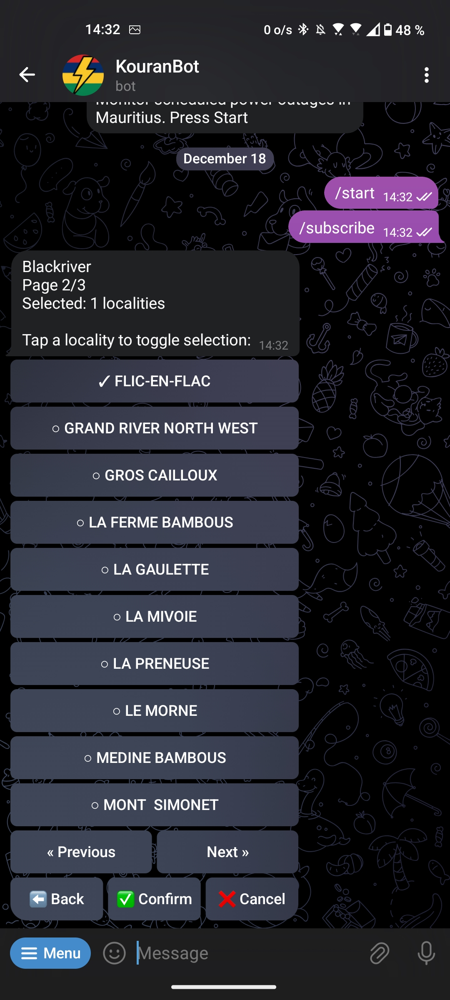
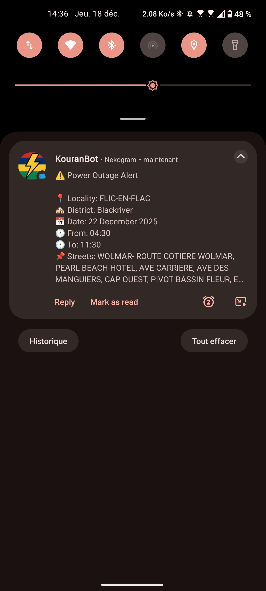

# KouranBot

Telegram bot for power outage alerts in Mauritius. Subscribe to localities and get notified when outages are scheduled.

<div align="center">

### 🤖 Try It Now

**[Open in Telegram →](https://t.me/Kouran_Bot)**

or search for `@Kouran_Bot` in Telegram

</div>

## Screenshots

<p align="center">
  
  
  
</p>

## Run Your Own Instance

If you want to host your own bot:

1. **Get a bot token** from [@BotFather](https://t.me/botfather)

2. **Create `.env` file:**
```bash
cp .env.example .env
```

3. **Add your token to `.env`:**
```env
TELEGRAM_BOT_TOKEN=your_bot_token_here
POSTGRES_DB=kouranbot
POSTGRES_USER=kouranbot_user
POSTGRES_PASSWORD=your_secure_password
```

4. **Start the bot:**
```bash
docker-compose up -d
```

## Commands

- `/start` - Welcome message
- `/subscribe` - Subscribe to localities
- `/mysubscriptions` - View subscriptions
- `/unsubscribe` - Remove all subscriptions
- `/language` - Switch between English/French
- `/help` - Help message

## How It Works

1. Select a district
2. Choose localities within that district
3. Get notified when power outages are scheduled in your areas

The bot checks for new outages every 15 minutes.

## Data Source

[MrSunshyne/mauritius-dataset-electricity](https://github.com/MrSunshyne/mauritius-dataset-electricity)
